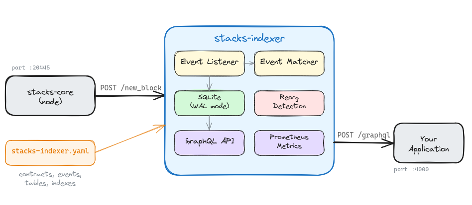

# stacks-indexer

A lightweight, self-hosted Stacks blockchain indexer. One binary, one SQLite file, one YAML config.

Index only the contracts and events you care about. No PostgreSQL, no Redis, no RocksDB, no Bitcoin dependencies.

## Architecture



## Why

The existing Stacks indexing stack (stacks-blockchain-api + chainhook + token-metadata-api) requires three services, two languages, multiple databases, and indexes everything on the chain whether you need it or not. A full mainnet index can exceed 1TB.

If you're building a dApp that only needs events from one or two contracts, that's a lot of infrastructure for a few tables of data.

stacks-indexer connects directly to stacks-core's event observer protocol and stores only matched events in a local SQLite database with an auto-generated GraphQL API.

## How it works

1. stacks-core POSTs block events to your indexer via HTTP (`/new_block`)
2. The indexer matches events against your YAML config (contract ID + event type)
3. Matched events are stored in SQLite tables you define
4. A GraphQL API is auto-generated for each table with filtering, pagination, and subscriptions

## Quick start

```
cargo install stacks-indexer
```

Create a config file `stacks-indexer.yaml`:

```yaml
name: "my-indexer"
network: devnet
server:
  event_listener_port: 20445
  api_port: 4000
storage:
  path: "./data/indexer.db"
sources:
  - contract: "ST1PQHQKV0RJXZFY1DGX8MNSNYVE3VGZJSRTPGZGM.counter"
    start_block: 0
    events:
      - name: prints
        type: print_event
        table: counter_events
  - contract: "*"
    events:
      - name: transfers
        type: stx_transfer
        table: stx_transfers
```

Run it:

```
stacks-indexer dev -c stacks-indexer.yaml
```

Point your stacks-core node at the indexer by adding to your node config:

```toml
[[events_observer]]
endpoint = "host.docker.internal:20445"
events_keys = ["*"]
timeout_ms = 30000
```

Open `http://localhost:4000/graphql` to query your data.

## Config reference

| Field | Description | Default |
|---|---|---|
| `name` | Instance name | required |
| `network` | `mainnet`, `testnet`, or `devnet` | required |
| `server.event_listener_port` | Port for stacks-core event POSTs | `20445` |
| `server.api_port` | GraphQL / REST API port | `4000` |
| `storage.path` | SQLite database file path | `./data/indexer.db` |
| `rpc_url` | Stacks RPC URL for backfill | per-network default |
| `sources[].contract` | Contract identifier or `"*"` for all | required |
| `sources[].start_block` | Block height to start indexing from | `0` |
| `sources[].events[].name` | Event name | required |
| `sources[].events[].type` | Event type (see below) | required |
| `sources[].events[].table` | Target SQLite table | required |
| `sources[].events[].indexes` | JSON fields to index | `[]` |

### Event types

| Type | Matches |
|---|---|
| `print_event` | Clarity `(print)` contract events |
| `stx_transfer` | STX transfer events |
| `stx_mint` | STX mint events |
| `stx_burn` | STX burn events |
| `stx_lock` | STX lock events |
| `ft_transfer` | Fungible token transfers |
| `ft_mint` | Fungible token mints |
| `ft_burn` | Fungible token burns |
| `nft_transfer` | NFT transfers |
| `nft_mint` | NFT mints |
| `nft_burn` | NFT burns |

## API endpoints

| Endpoint | Description |
|---|---|
| `GET /health` | Health check with sync status |
| `GET /metrics` | Prometheus metrics |
| `POST /graphql` | GraphQL queries |
| `GET /graphql` | GraphQL playground (dev mode) |
| `POST /new_block` | Block events from stacks-core |
| `POST /new_burn_block` | Burn block events |

### Workspace crates

| Crate | Purpose |
|---|---|
| `stacks-indexer-core` | Types, config, Clarity decoder, event matcher |
| `stacks-indexer-storage` | SQLite storage, reorg detection, backfill |
| `stacks-indexer-server` | HTTP server, GraphQL, metrics |
| `stacks-indexer` (cli) | CLI binary |

## Comparison

| | stacks-blockchain-api | chainhook | stacks-indexer |
|---|---|---|---|
| Index scope | Everything | Predicate-filtered | YAML-configured |
| Storage | PostgreSQL (500GB+) | RocksDB + SQLite + Redis | SQLite (your data only) |
| Dependencies | Node.js, PostgreSQL, Redis | Clarity VM, Bitcoin RPC, RocksDB | Rust, SQLite |
| Setup | 40+ env vars, 3 services | Config + webhook receiver | 1 YAML file |
| Query layer | REST API | Webhook delivery | Auto-generated GraphQL |
| Reorg handling | Multi-table canonical flags | Fork scratch pad (7-block) | SQLite journal rollback |

## License

MIT OR Apache-2.0
